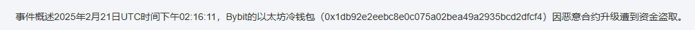
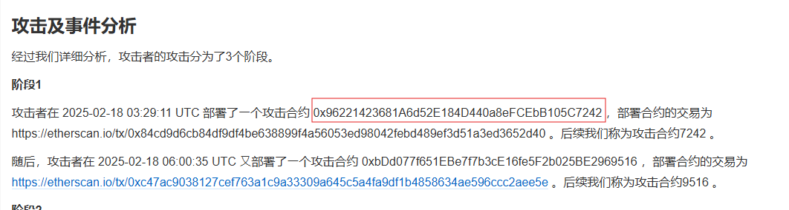
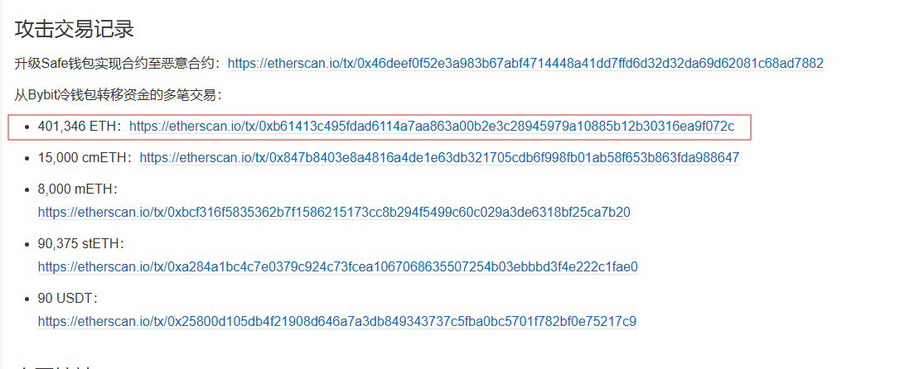
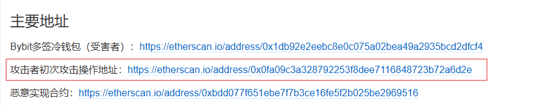

# Bybit Attack

There was a Bybit exchange hack occured during Feb 2025. You can find the following information about the attack?

1. Bybit cold wallet address
2. The transaction hash which created the first attacker smart contract
3. The transaction hash which the attacker extract the funds from Bybit (Most ETH)
4. The attacker address found in the attacker smart contract

Author: Sunny

Flag Format: PUCTF25{address1_address2_address3_address4}

---

### 1 Search for information on the internet :

This is an information gathering challenge.

We can found all answer in :

https://learnblockchain.cn/article/11617

https://learnblockchain.cn/article/11188

### 2  Extract the data :

1. Bybit cold wallet address:

**0x1db92e2eebc8e0c075a02bea49a2935bcd2dfcf4**

2. The transaction hash which created the first attacker smart contract:

**0x84cd9d6cb84df9df4be638899f4a56053ed98042febd489ef3d51a3ed3652d40**

3. The transaction hash which the attacker extract the funds from Bybit (Most ETH)

**0xb61413c495fdad6114a7aa863a00b2e3c28945979a10885b12b30316ea9f072c**

4. The attacker address found in the attacker smart contract

**0x0fa09C3A328792253f8dee7116848723b72a6d2e**

### 3 Get the flag :

So that we can get the flag:

PUCTF25{0x1db92e2eebc8e0c075a02bea49a2935bcd2dfcf4_0x84cd9d6cb84df9df4be638899f4a56053ed98042febd489ef3d51a3ed3652d40_0xb61413c495fdad6114a7aa863a00b2e3c28945979a10885b12b30316ea9f072c_0x0fa09C3A328792253f8dee7116848723b72a6d2e}

‍
