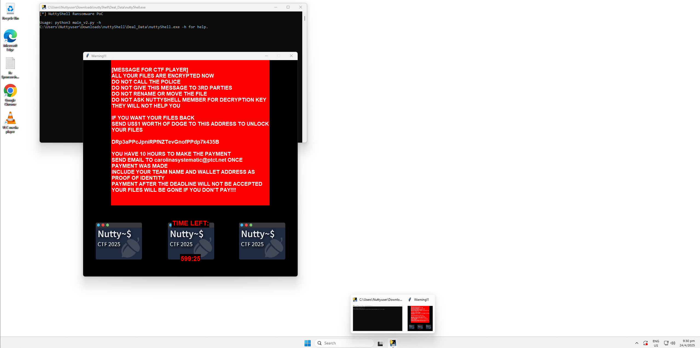
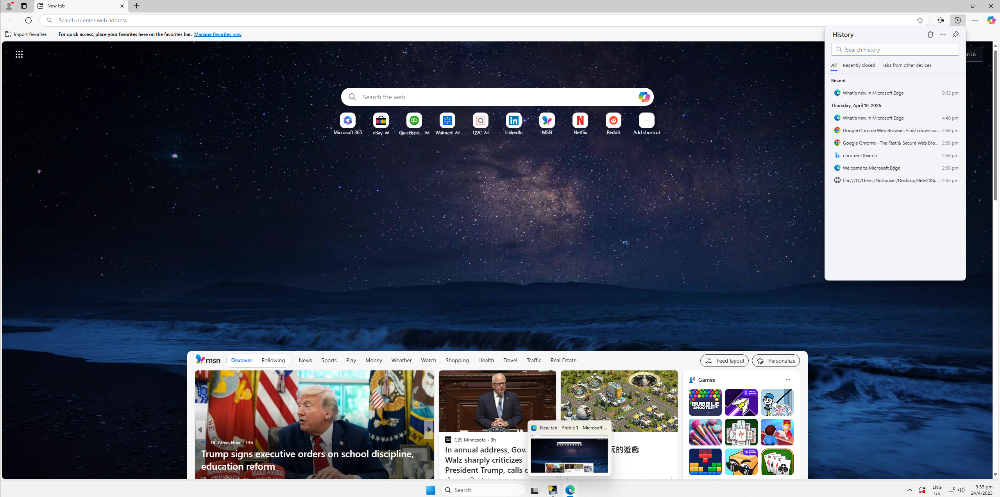
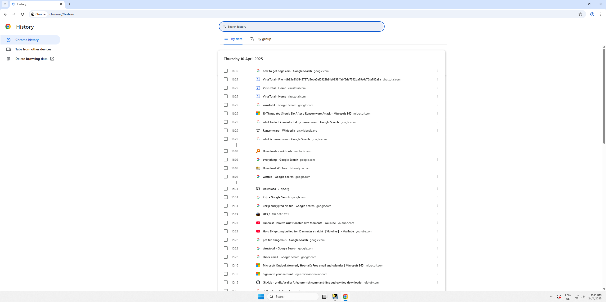
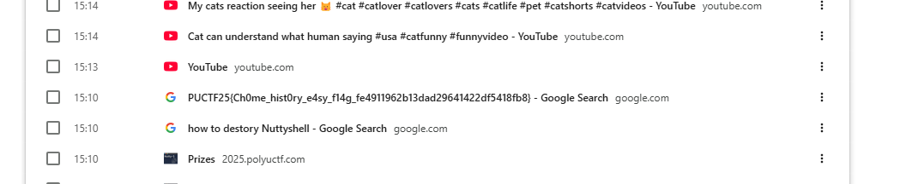

# Deadliest Catch I

This day and age in this economy, it's hard to find sponsors for our CTF events, so we'll take anything we can get when in comes to sponsorship.  
Enters Kiki, our Public Relation manager, who had seemingly found a good deal for NuttyShell upcoming CTF, the best of them deals even.  
But you know what they say, when something sounds too good to be true, it usually is, and she felt for the oldest trick of the book, Phishing!

Everything in her personal folders are encrypted and it seems that the attacker is asking for a heftly sum of cryptocurrency in exchange for giving our data back.  
Not knowing what to do, Kiki surrenders his PC to us to see if there's a way to get her data back.

The first challenge is a guided challenage in order to familiarize player with Digital Forensics.  
It appears that when preparing for the CTF compeititon, Kiki accidently type a flag on to the search bar.  
Find out what she had typed with the help of the guide!

Note: This is a VMWare's VM, If you'd like to turn it on, The vTPM password is (allyourfilesareencrpyted) without quotes.

Author: PurpleSe4shell  
Flag Format: PUCTF25{[\x00-\x7F]*}

---

### 1. Challenge Background :

The challenge description states:

> "It appears that when preparing for the CTF competition, Kiki accidentally typed a flag into the search bar."

Our first step is therefore to look for the flag in the browser history.

---

### 2. Initial Environment Inspection :

After unzipping the provided attachment, we imported the virtual machine image into VMware. On the desktop, we observed several items:

* Google Chrome
* Microsoft Edge
* A file on the Desktop
* A suspicious file named `nutty5shell.exe`​ (which appears to be malware)

Since the challenge focuses on browser history, we decided to concentrate our investigation on Microsoft Edge and Google Chrome.

### 3 Checking Microsoft Edge :

We open Microsoft Edge and check the browsing history. We can see that the user opened a local file and downloaded Chrome using Edge, but there is no other useful information. Therefore, we proceed to check Google Chrome.

### 4 Checking Google Chrome :

In Google Chrome, we can see that there is a lot of search history. As we scroll down through the entries,

We can see that user search a flag : PUCTF25{Ch0me_hist0ry_e4sy_f14g_fe4911962b13dad29641422df5418fb8}

So PUCTF25{Ch0me_hist0ry_e4sy_f14g_fe4911962b13dad29641422df5418fb8} is the flag

‍
