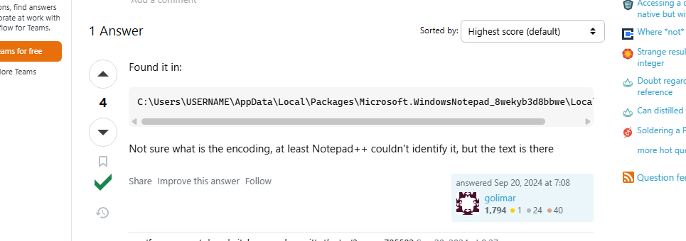
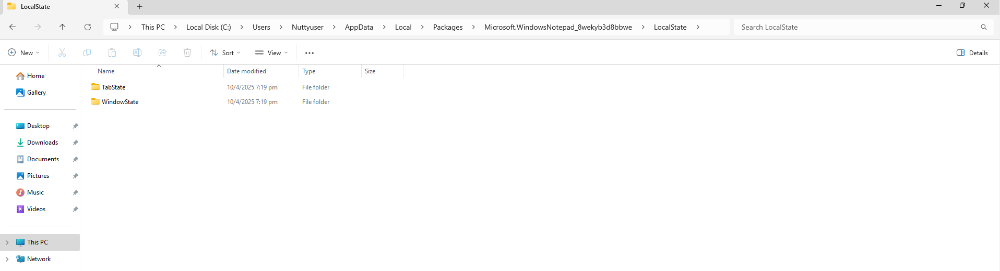
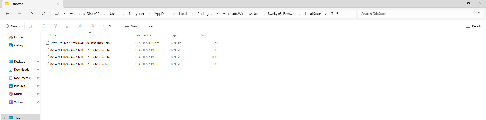
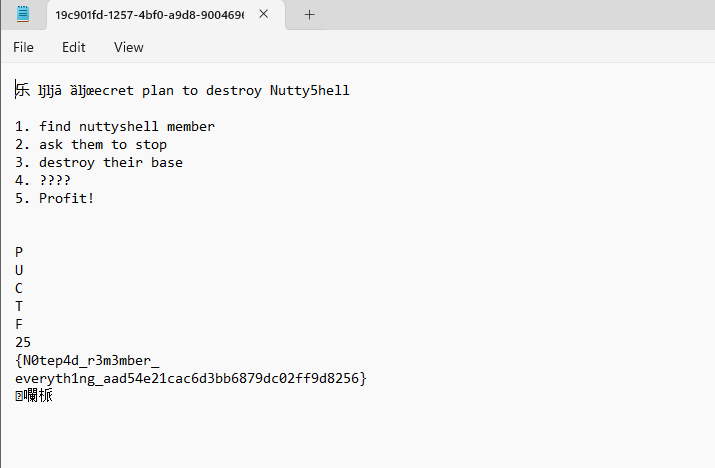

# Deadliest Catch II

Author: PurpleSe4shell(Please use the file from Deadliest Catch I)

It seems that before Kiki wrote some important information on Notepad before giving her PC to us.  
She said she forgot to save it and its really important to have this file back.  
Luckly the ransomware didn't encrypt it.  
Could you help her recover the data?

Author: PurpleSe4shell

Flag Format: PUCTF25{[\x00-\x7F]*}

---

### 1 Challenge Overview :

This question requires us to find where Notepad saves unsaved files.

### 2 Research :

We searched on Google and found a result about [“where are Notepad temp/unsaved .txt files located.”](https://superuser.com/questions/1856217/where-are-notepad-temp-unsaved-txt-files-located)

We found that someone has answered this question. 

> C:\Users\USERNAME\AppData\Local\Packages\Microsoft.WindowsNotepad_8wekyb3d8bbwe\LocalState

### 3 Navigating to the Location :

So, we navigate to this folder to take a look. We can see there have 2 folder

We click on the first folder (TabState first).

### 4 Examining the Files :

We can see that there are four files. We check them one by one:

We are lucky—we found the flag in the first file. 

> C:\Users\Nuttyuser\AppData\Local\Packages\Microsoft.WindowsNotepad_8wekyb3d8bbwe\LocalState\TabState\19c901fd-1257-4bf0-a9d8-9004696dbc02.bin

PUCTF25{N0tep4d_r3m3mber_everyth1ng_aad54e21cac6d3bb6879dc02ff9d8256}

‍
