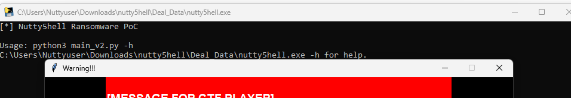
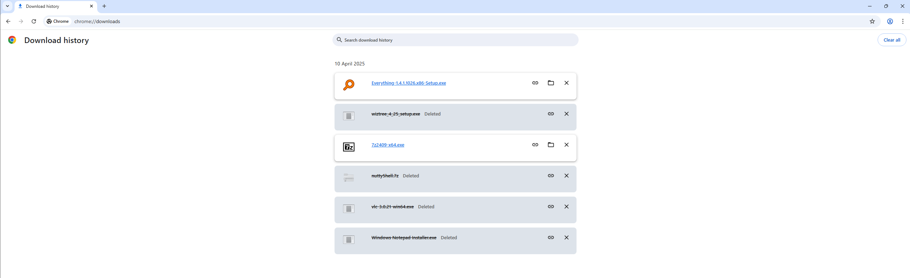
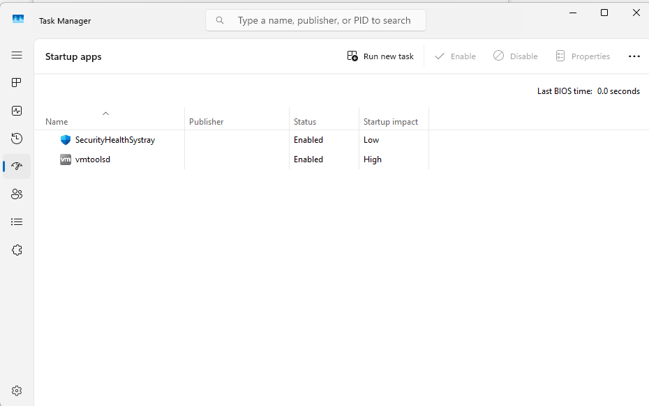
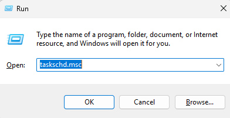
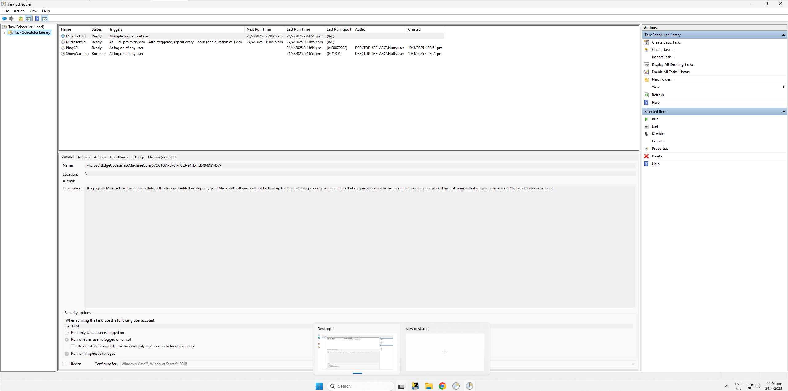
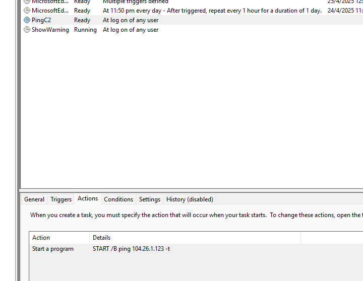

# Deadliest Catch III

(Please use the file from Deadliest Catch I)

While reading the Chrome history, we found where Kiki had donwloaded the ransomware to the computer  
It seems to be someplace local, which means theres a compromied machine elsewhere in her internal network.  
We also found that once the ransomware was ran, it created a persistance and tries to phone home to the attacker's Command and Control (C2) server.

Note: There is no need to decompile the ransomware, the C2 in the decompiled ransomeware is not an intended solution.

Find the URL of where Kiki had downloaded the ransomware and the IP of the Attacker's C2 Server

Follow this flag format when submitting the flag:  
PUCTF25{$complete_URL_$IP_of_C2}  
For example:  
PUCTF25{https://evil.co/malware.zip_127.0.0.1}

Author: PurpleSe4shell

Flag Format: PUCTF25{[\ x00-\x7F]*}

Hint: How can a malware survive a reboot? (How to establish persistance?)

---

## 1 Challenge Overview

This challenge requires us to find two things:

* The ransomware download URL
* The C2 (Command and Control) IP address

## 2 Ransomware Download URL :

First , let we find the ransomware download URL first:

We can see the ransomware file named nutty5shell.exe under Deal_data > nutty5shell > download. This means we might be able to find the download URL in Chrome's download history.

Here is Chrome's download history

We can see a file named nutty5shell.7z, which matches the name of the ransomware. So, we click the URL button on the right-hand side to copy the download address, and we get:

http://192.168.142.1/nutty5hell.7z

So this is the first thing we needed to find.

### 3 C2 (Command and Control) IP Address :

Now, let's move on to the second item—the C2 IP address. Since we unlocked a hint: "How can a malware survive a reboot? (How to establish persistence?)", we know that the malware will run automatically after the system starts. The most common methods are setting the malware in Autostart Entries or Scheduled Tasks.

#### 3.1 Check Autostart Entries

First, we check the Autostart Entries. We open Task Manager and go to the Startup Apps tab. We only see "SecurityHealthSystray" and "vmtolsd"; neither of these matches the ransomware. So, we move on to check the Scheduled Tasks.

#### 3.2 Check Scheduled Tasks

We can press Win + R, type taskschd.msc, and press Enter. This will open the Task Scheduler.

Click Task Scheduler Library :

We can see that there are four tasks on the right-hand side, and one of them is named "PingC2," which matches what the question is asking for.

We can see that "PingC2" will run `ping 104.26.1.123`​, so this is the IP address of the attacker's C2 server.

### 4 Final Flag :

So that we can know the flag is PUCTF25{http://192.168.142.1/nutty5hell.7z_104.26.1.123}

### 5 Conclusion :

* Found the ransomware download URL in Chrome’s download history.

* Identified the C2 IP address in a Scheduled Task named "PingC2".

* Combined both findings to form the final flag.

‍
