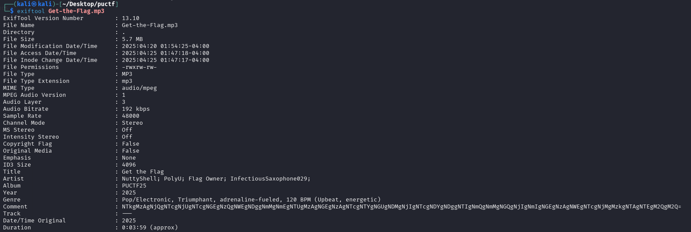
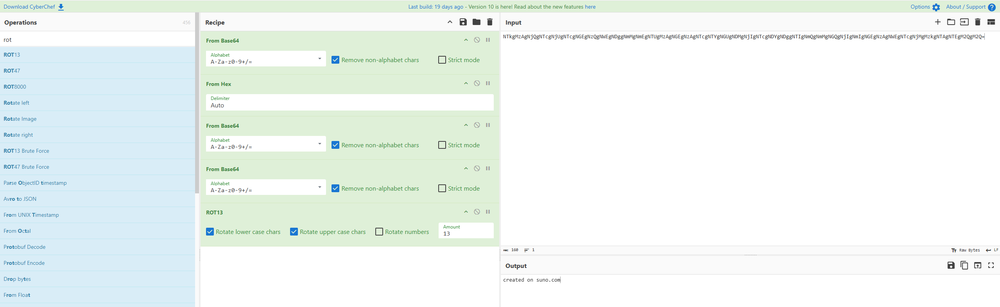
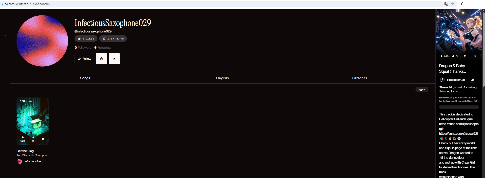
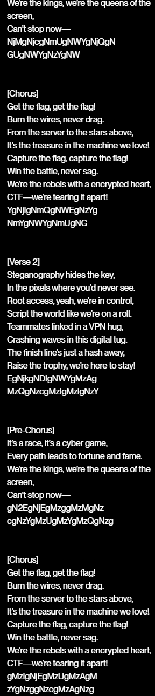
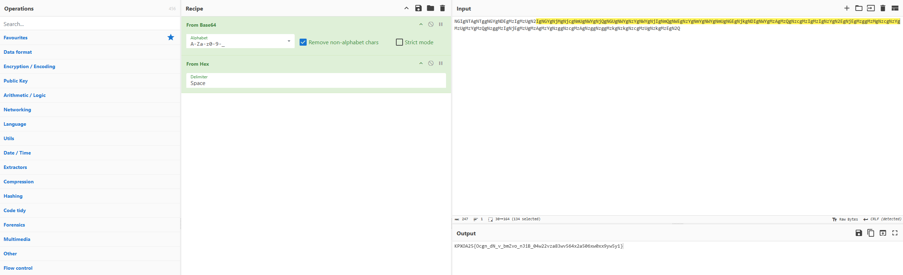
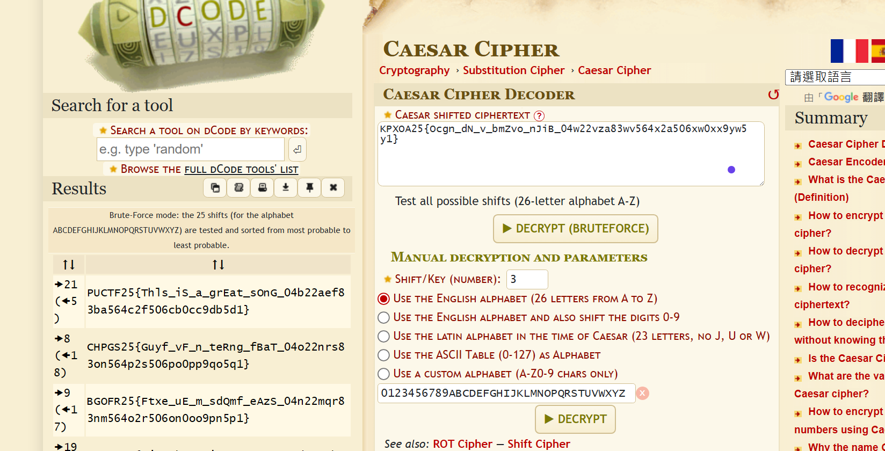

# Get the Flag

This song is good, maybe you can get the lyrics somewhere...  
Notes: This challenge does not require you to register/login on any website.

Author: Paco

Flag Format: PUCTF25{[a-zA-Z0-9_]+_[a-fA-F0-9]{32}}

---

### 1 Introduction

Our team was unable to find the flag before the competition ended because we did not notice the song on the website. After the competition, we learned from other participants that the flag could be found via the website, which led us to revisit the challenge and successfully retrieve the flag.

### 2 Metadata Extraction from MP3

First, we used `exiftool`​ to extract metadata from the provided MP3 file.

From the metadata, we found these key fields:

* **Title:**  Get the Flag
* **Artist:**  NuttyShell; PolyU; Flag Owner; InfectiousSaxophone029;
* **Comment:**   
  NTkgMzAgNjQgNTcgNjUgNTcgNGEgNzQgNWEgNDggNmMgNmEgNTUgMzAgNGEgNzAgNTcgNTYgNGUgNDMgNjIgNTcgNDYgNDggNTIgNmQgNmMgNGQgNjIgNmIgNGEgNzAgNWEgNTcgNjMgMzkgNTAgNTEgM2QgM2Q=

### 3 Decoding the Comment Field :

We suspected the comment field was encoded. Using CyberChef, we decoded the string:

We can know created on suno.com which is a AI music platform.

### 4 Searching for the Song on Suno.com

We search InfectiousSaxophone029 on suno.com

We found the song titled Get the Flag.

### 5 Extracting Data from Song Lyrics :

Reviewing the song's lyrics, we found another encoded string:

> NGIgNTAgNTggNGYgNDEgMzIgMzUgN2IgNGYgNjMgNjcgNmUgNWYgNjQgNGUgNWYgNzYgNWYgNjIgNmQgNWEgNzYgNmYgNWYgNmUgNGEgNjkgNDIgNWYgMzAgMzQgNzcgMzIgMzIgNzYgN2EgNjEgMzggMzMgNzcgNzYgMzUgMzYgMzQgNzggMzIgNjEgMzUgMzAgMzYgNzggNzcgMzAgNzggNzggMzkgNzkgNzcgMzUgNzkgMzEgN2Q

We pasted this into CyberChef, decoding it and got: `KPXOA25{Ocgn_dN_v_bmZvo_nJiB_04w22vza83wv564x2a506xw0xx9yw5y1}`​

### 6 Final Step: Caesar Cipher Decryption

The decoded string did not match the expected flag format (`PUCTF25{...}`​). We suspected a Caesar cipher was used.

Using [dCode&apos;s Caesar Cipher tool](https://www.dcode.fr/caesar-cipher), we pasted the string and let the tool analyze it.

The tool automatically decrypted the flag:

​`PUCTF25{Thls_iS_a_grEat_sOnG_04b22aef83ba564c2f506cb0cc9db5d1}`​

### 7 Conclusion:

1. Extracted MP3 metadata using exiftool.
2. Decoded the comment field to learn about Suno.com and the artist.
3. Located the song and artist on Suno.com.
4. Extracted and decoded string from the lyrics.
5. Identified and decrypted a Caesar cipher to reveal the flag.
