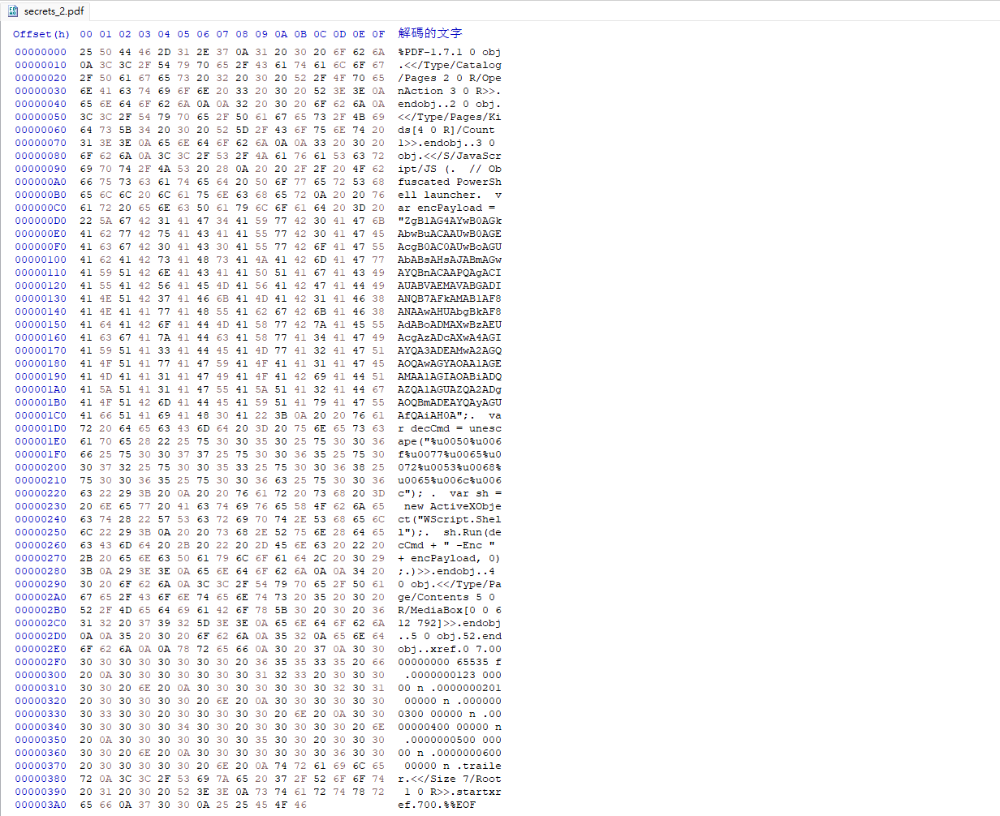
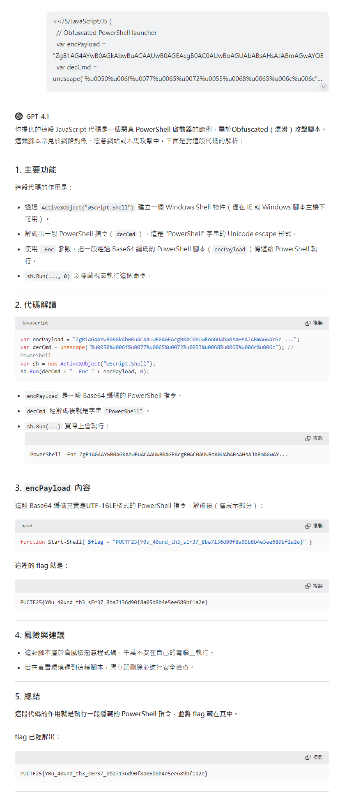
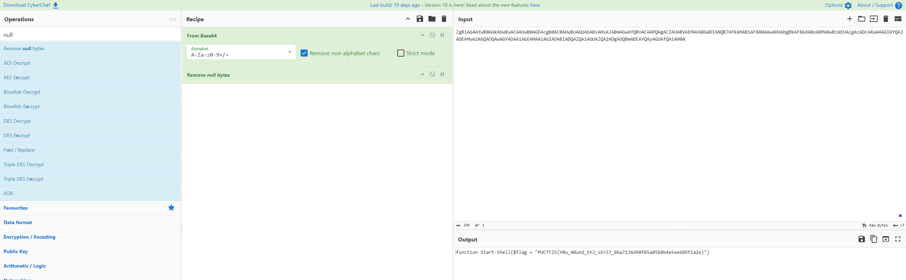

# Hidden Secrets

A flag lies hidden within a PDF, embedded in obfuscated code. Can you analyze the document structure and decode the secrets?

Author: Steven

Flag Format: PUCTF25{[a-zA-Z0-9_]+_[a-fA-F0-9]{32}}

---

### 1. Initial Analysis

#### 1.1 Open the PDF in HxD

and we can see there have a JavaScript, we will try to decode it

### 2 Decode the Payload :

#### 2.1 Using AI Assistance

Copy the JavaScript and submit it to an AI (such as ChatGPT) for analysis and decoding.

#### 2.2. Using CyberChef

Alternatively, paste the payload into CyberChef, a powerful online tool for data format conversions and decoding. This helps to quickly recover the original content.

### 3 Get the Flag :

PUCTF25{Y0u_40und_th3_sEr37_8ba7136d90f85a05b8b4e5ee689f1a2e}

‍
