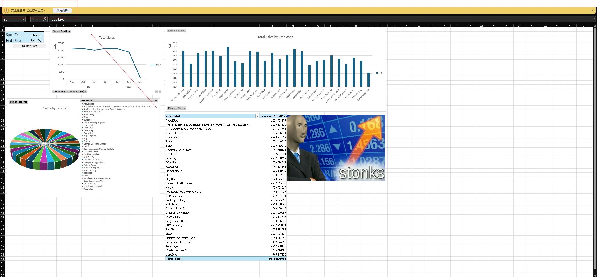
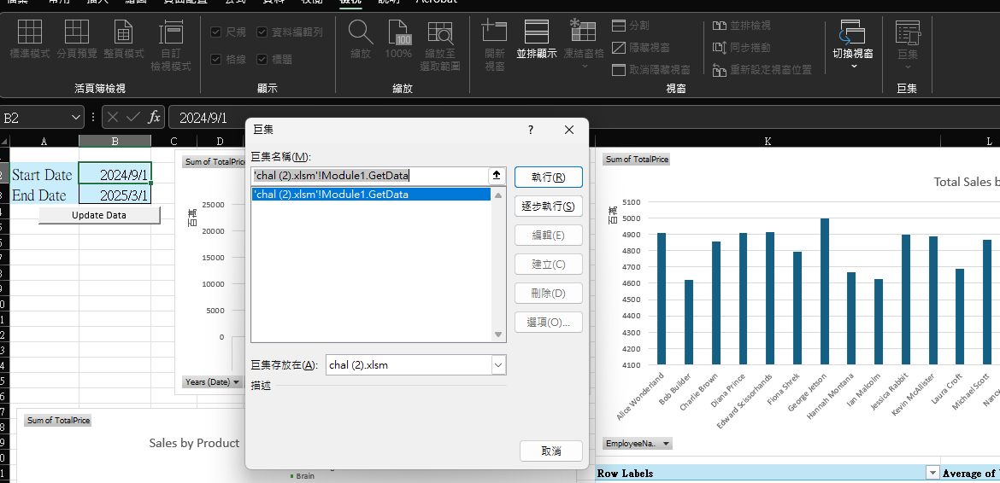
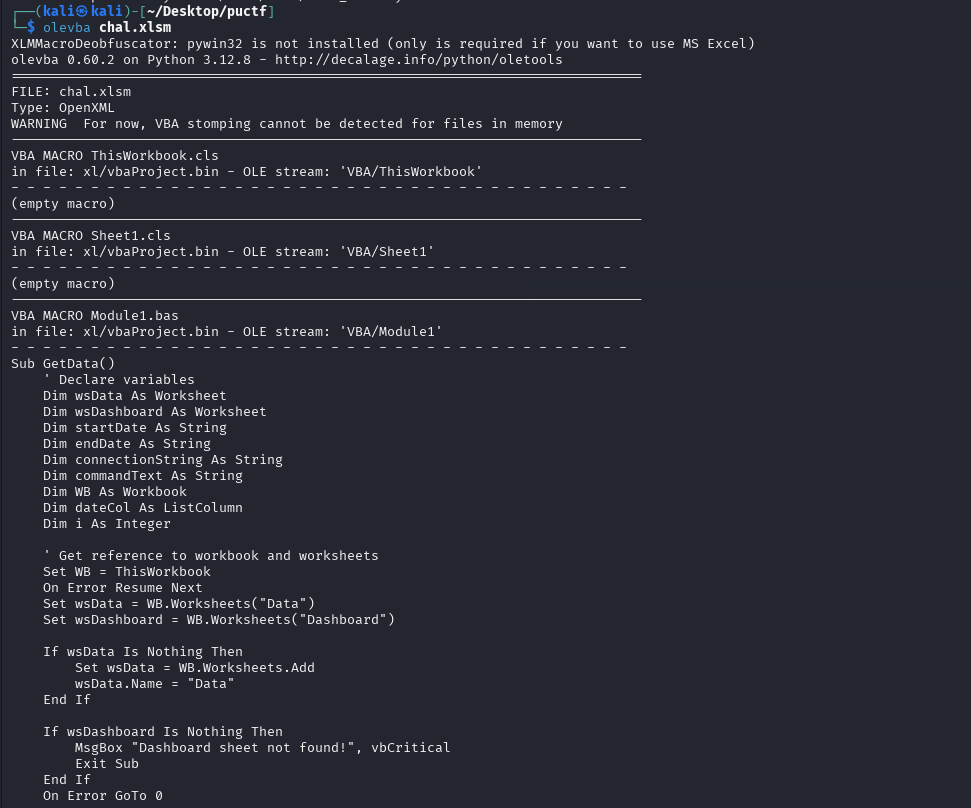
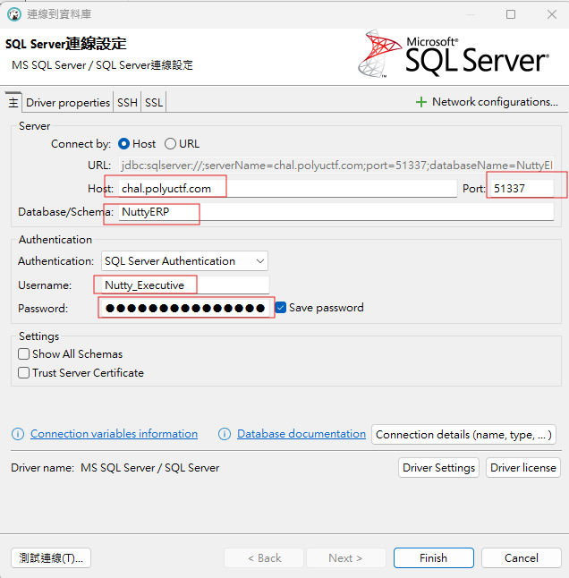
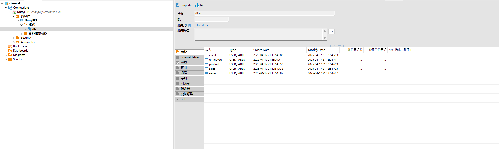
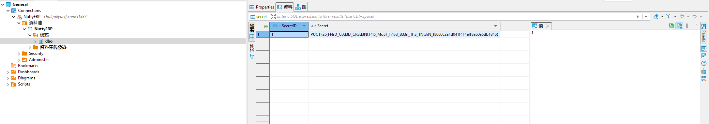

# Business Intelligence

Business is booming! let's see what insights we can get from all this data.

Author: Jomapisa

Flag Format: PUCTF25{[a-zA-Z0-9_]+_[a-fA-F0-9]{32}}

---

### 1 Open the Excel file and make a preliminary observation :

First, we open the Excel file provided in the question.

#### 1.1 Macro security warning

After opening the file, the most noticeable thing is the security warning at the top, indicating that macros have been disabled.



#### 1.2 Attempt to edit the macro

We tried to directly edit the macros to see what code was inside, but found that the edit option was not clickable. Therefore, we needed to use other methods :



### 2 Use the olevba tool to recover the macro code :

I put this file into Kali and used the olevba tool. You need to install it first with the following command:

```cmd
sudo -H pip install -U oletools[full]
```

```cmd
olevba chal.xlsm
```

After running the command, you can see the contents of the macro displayed below.



### 3 Found the ODBC connection string and connected to SQL Server :

Among the contents, we found an ODBC server address, so we tried to connect to it by [DBeaver](https://dbeaver.io/) to see what we could find.


> connectionString = "ODBC;DRIVER=SQL Server;SERVER=chal.polyuctf.com,51337;DATABASE=NuttyERP;UID=Nutty_Executive;PWD=NuttExec03172025;"



### 4 Explore the database structure and search for the flag :

#### 4.1 View the tables

After that, we found that there are five tables in this SQL server: client, employee, product, sales, and secret.



#### 4.2 query the secret table

As CTF players, we know that the table named secret might contain hints or the flag, so we double-clicked on secret to see what information it contains.



### 5 Get the Flag :

We can see that the flag is included here:

PUCTF25{H4rD_C0d3D_CR3d3Nt14l5_Mu5T_h4v3_B33n_Th3_1Nt3rN_f8060c2a1d041f414eff8a60a5db1846}

### 6 Conclusion :

* Open the Excel file and find that the macro is locked.

* Use the olevba tool to recover the macro code and obtain the ODBC connection information.

* Connect to SQL Server via DBeaver and explore the tables.

* Find the flag in the secret table and complete the challenge.
