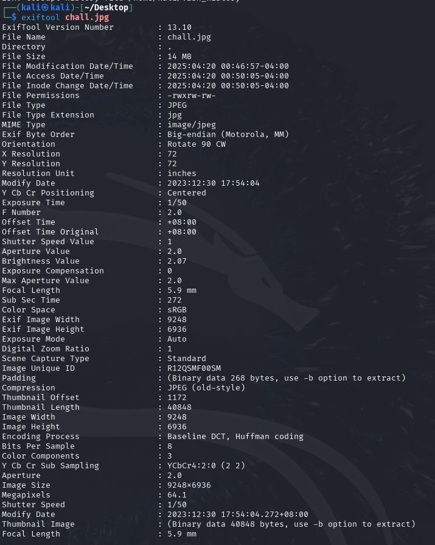
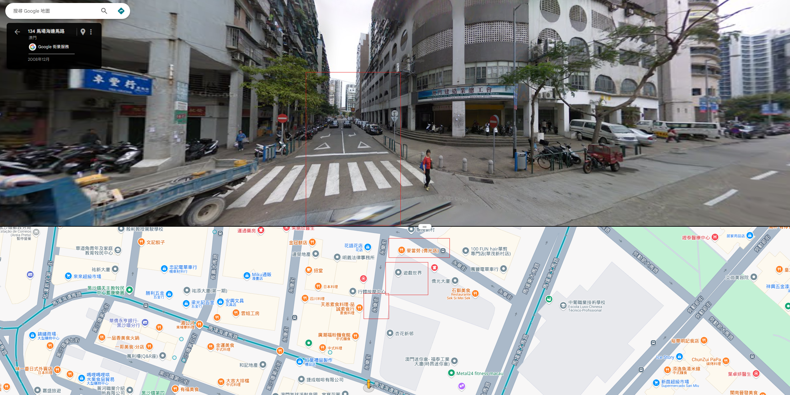
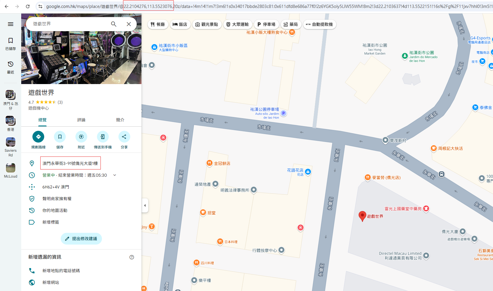

# Catch that Arcadeholic

Jeffrey is one of the member in Nuttyshell, but he is addicted to video arcade games now and don't want to play CTF for a lifetime.  
We hacked his phone and found some photos from his gallery that might help us to find him, can you help us to find him?

Flag format: PUCTF25{<street_name_with_underscore>_<xxx.xxx_xxx.xxx(geolocation_of_the_location_in_the_image)>}  
PS: The first letter of the street name should be capitalized, e.g. foo bar street should be written as Foo_Bar_Street, the decimal places of the geolocation should be three digits without rounding.

Author: SleepyJeff

Flag Format: PUCTF25{[a-zA-Z_]+_[0-9]{2}\.[0-9]{3}_[0-9]{3}\.[0-9]{3}}

---

### 1 Check Document Metadata :

First , I will use exiftool to check is there have any information hide in the photo:

### 2 Find it in Google Map :

We can see that the photo doesn't include any location information. That means we need to use Google Maps to find it.

#### 2.1 Integrate Information

When we look at the photo, there are some details that might be helpful for us. First, there is a McDonald's logo, and there is a car license plate that starts with "MW", which means it's located in Macau. From the title, "Catch that Arcadeholic," we can also tell that there is an Amusement Arcade nearby. So we have some clues: this photo was taken in Macau, and there is a McDonald's and an amusement arcade nearby.

#### 2.2 Search for the target on the map based on the information

And find in google map sometimes,  you can found this location in at Rua Alegre

And we can get the street name and geolocation here:

So that we can get : PUCTF25{Rua_Alegre_22.210_113.552}

‍
