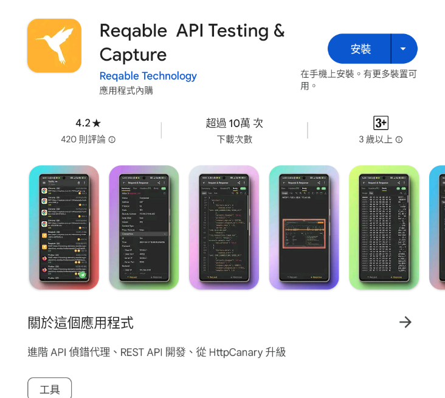
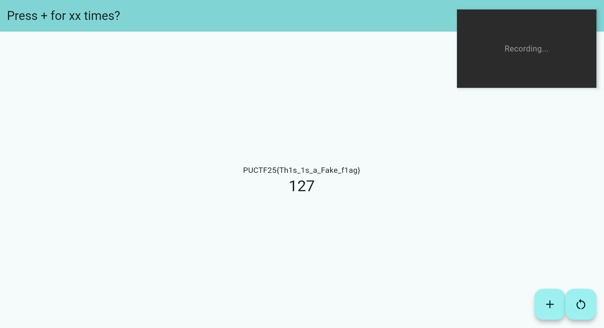
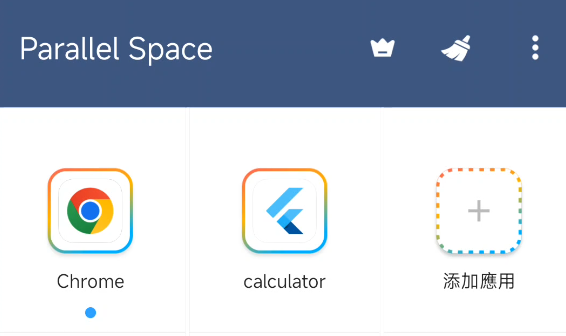
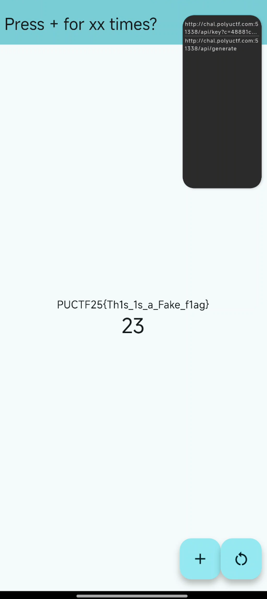
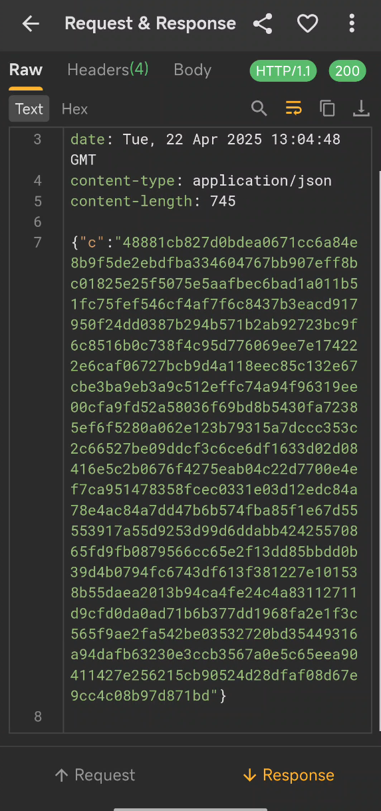
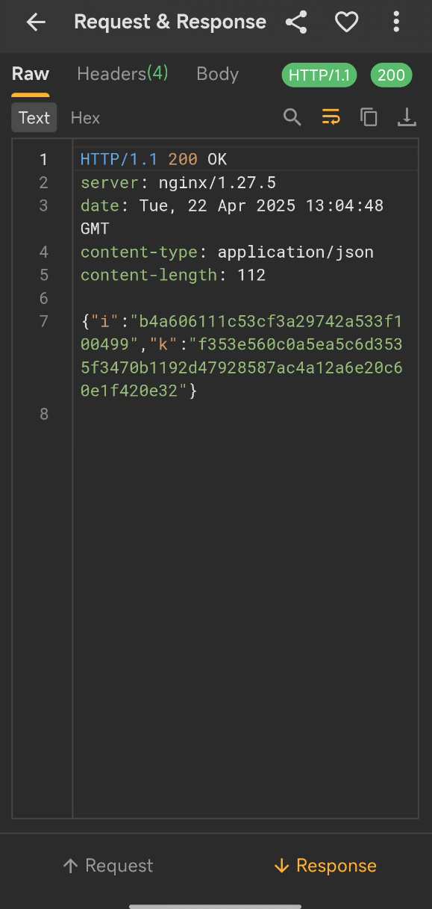
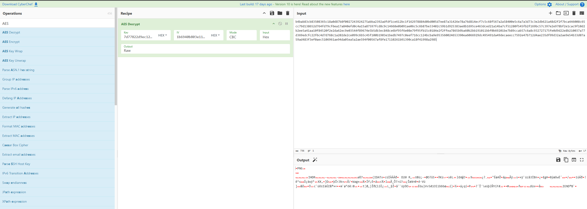
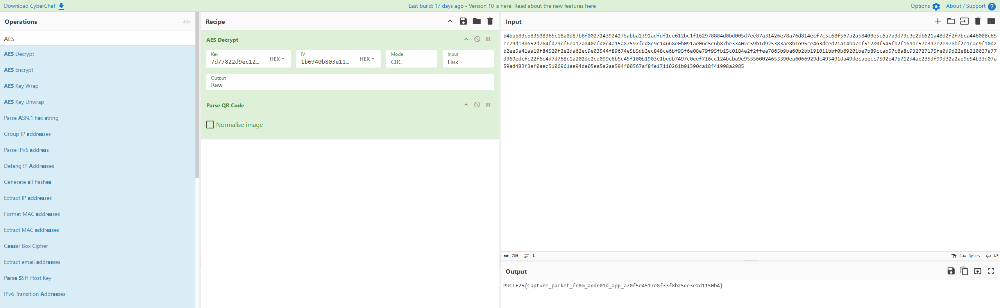

# Normal Application II

Can you analyze the application and give me the flag

Author: R1ckyH

Flag Format: PUCTF25{[a-zA-Z0-9_]+}

---

### 1 **Introduction :**

Actually, during the competition, I wasn’t able to solve this challenge. It was only after the competition ended, when I saw the author’s hint to "capture traffic," that I was able to solve it.

### 2 **Tool Selection and Initial Attempts :**

First of all, if you want to capture network traffic, you can use many tools like [Wireshark](https://www.wireshark.org/) or [Charles](https://www.charlesproxy.com/). However, considering that CTF challenges usually don’t use HTTPS, you can simply install the [Reqable API Testing &amp; Capture App](https://play.google.com/store/apps/details?id=com.reqable.android) on your phone. This way, you don’t need to bother with installing HTTPS certificates or setting up port forwarding.



Then I started capturing packets and opened the app, but even after clicking add button for a long time, there was no network traffic at all.



### 3 **Problem Analysis and In-depth Discussion :**

Through Google search, I found that Flutter apps may directly call the underlying network interface (dart:io), which can result in traffic not being captured by system proxies or VPNs.

https://yamsergey.medium.com/flutter-and-proxy-1e2b6acd24f5

https://requestly.com/blog/debug-network-requests-in-flutter-using-requestly/?locale=zh_HK

Key point: VPN/proxy methods cannot intercept traffic generated by dart:io, so alternative solutions are needed.

Later, I found that the solutions online were quite complicated. In short, the goal is to make the .so file not use the low-level network interfaces.So I started thinking about ways to run the app inside a container, and then capture its network traffic from the outside.

Then I suddenly remembered that when playing games, if you need multiple accounts, you can use "parallel space" or "dual space" apps to switch accounts. The principle behind these apps is that they make the target app run inside a sandbox or container.

### 4 **Step-by-step Procedure :**

#### 4.1 **Capturing Traffic Using Parallel Space**

So I started to try this method: I downloaded [Parallel Space](https://play.google.com/store/apps/details?id=com.lbe.parallel.intl) and added the target app into it.


Since using an Android emulator on my computer caused the app to crash, I decided to do it directly on my phone.



I started capturing traffic and ran the app inside Parallel Space.



#### 4.2 **Analysis of Captured Network Requests**

You can see that when the fake flag appears, there is a network request.Open the detailed information.:



We can see that in the first request, the server returns "c" and something



The second request returns "i" and "k" information.

```cmd
{"c":"b4bab83cb83508365c18a0d87b8f0027243924275abba2392adfdf1ce612bc1f162978884d0bd005d7ee87a31426e78a76d814ecf7c5c68f567a2a58400e5c6a7a3d73c3e2db621a48d2f2f7bca446008c65cc79d138652d764fd79cf6ea17a840efd0c4a15a87597fcd8c9c14668e0b091ae06c5c6b87be33402c59b1d925383ae8b1695ce463dced21a14ba7cf51280f545fb2f169bc57c397e2e978bf2e1cac9f10d2b2ee5a41aa10f84520f2e2da62ec9e03544f89674e5b5db3ec848ce6bf95f6e08e79f95fb15c0184e2f2ffea7865b9ba60b2bb191011bbf0b69201be7b89ccab57c6a8c932727175fe0d9d22e8b210037a77d369edcfc22f6c4d7d768c1a202de2ce099c6b5c45f100b1903e1bedb7497c0eef716cc124bcba9e953560024653390ea6066929dc495491da49decaeecc7592e47b712d4ae235df99d32a2ae9e54b33d07a59ad483f3ef0aec5106961ae94da05ea5a2ae594f00567af8fe17110261b91390ca18f41998a2985"}
{"i":"1b6940b803e114e82c3d66b3d9a32b06","k":"7d77822d9ec12bc63336c4a8a3061aa84a1c0c4f3871430f9e6f08b4ae6f44ae"}
```

### 5 **Data Decryption and Flag Acquisition :**

#### 5.1 **Decryption Logic Reasoning**

After seeing these, I realized that something should be used to decrypt the data. I guessed that "k" is likely the key, and "i" might be the IV (Initialization Vector). So, I tried to use AES mode to decrypt it.

#### 5.2 **Decryption Steps (Using CyberChef as an Example)**



After setting everything up, we saw that the output was a PNG file and there was a magic wand icon in CyberChef. When the magic wand appears in CyberChef, it means it has recognized how to further process or decode the data. So, we clicked on it.



The flag then appeared!

PUCTF25{Capture_packet_fr0m_andr01d_app_a70f5e4517e8f33f8b25ce3e2d1150b4}

### 6 Conclusion :

by leveraging sandbox/dual-app mechanisms, you can indirectly intercept traffic generated by `dart:io`​, thus bypassing the limitations where traditional proxies fail.

‍
