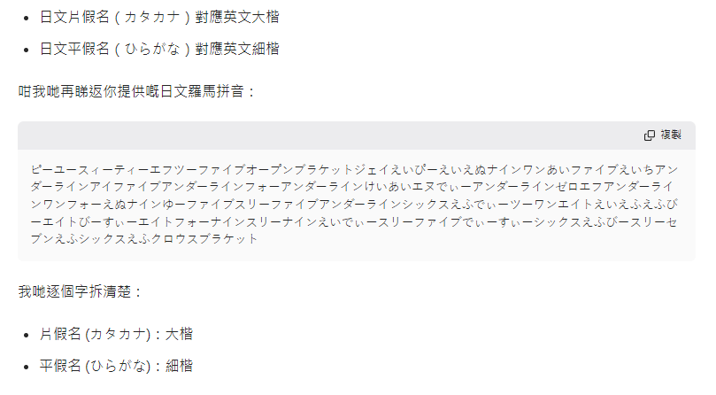
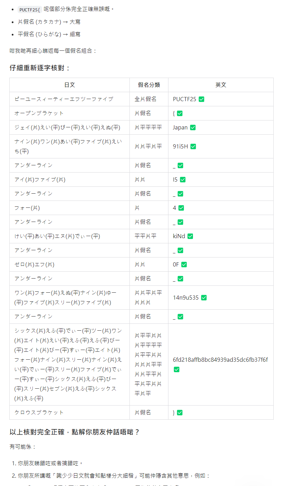
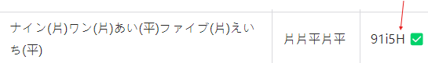

# 私日本語本当苦手

ピーユースィーティーエフツーファイブオープンブラケットジェイえいぴーえいえぬナインワンあいファイブえいちアンダーラインアイファイブアンダーラインフォーアンダーラインけいあいエヌでぃーアンダーラインゼロエフアンダーラインワンフォーえぬナインゆーファイブスリーファイブアンダーラインシックスえふでぃーツーワンエイトえいえふえふびーエイトびーすぃーエイトフォーナインスリーナインえいでぃースリーファイブでぃーすぃーシックスえふびースリーセブンえふシックスえふクロウスブラケット

Author: SalaryThief

Flag Format: PUCTF25{[a-zA-Z0-9_]+_[a-fA-F0-9]{32}}

---

We tried to submit the answer for this challenge many times during the competition, but we were never able to get it right. After the competition, we talked with other teams and realized that we were only missing a single letter...

Since none of our team members know Japanese, we relied entirely on AI to solve this challenge.

We used different AI tools to translate it into English, and generally got something like:

PUCTF25{JAPAN91I5H_I5_4_KIND_0F_14N9U535_6FD218AFFB8BC84939AD35DC6FB37F6F}

(The letter case might be a bit different.)

So, we tried submitting the flag in all lowercase and all uppercase, but it still wasn’t correct.

However, since the challenge specifically required correct letter casing, there must be something different in the Japanese text. After asking AI, we found out that Japanese Katakana characters correspond to uppercase English letters, while Hiragana characters correspond to lowercase English letters.

In the end, we got: PUCTF25{Japan91i5H_I5_4_kiNd_0F_14n9u535_6fd218affb8bc84939ad35dc6fb37f6f}

However, even after submitting this flag, it was still incorrect.

So I asked the AI to check it again, but it still said there was no problem :

So in the end, we still weren’t able to solve the flag. At the same time, we were also very confused.

It wasn’t until after the competition, when we discussed with other groups, that we realized one of the "h"s should have been lowercase, but AI had given us an uppercase "H".

But surprisingly, neither the AI nor we noticed this...

So, the correct answer in the end was: PUCTF25{Japan91i5h_I5_4_kiNd_0F_14n9u535_6fd218affb8bc84939ad35dc6fb37f6f}

We were just one "h" away from the correct flag ...

---

A small takeaway after this challenge:

Although AI can really help us solve a lot of problems, sometimes its reasoning process can contain small mistakes (like the letter casing in this challenge). If we had carefully reviewed the AI’s reasoning process instead of just looking at the final result, we probably could have avoided this error. Our team actually lost first place because of this question—we were only 103 points behind the top team. If we had double-checked the AI’s output during the competition, we might have won first place.

But the competition is over, and there’s no use regretting it now. Instead, this challenge has reminded me that when using AI, it’s important to double-check its output.

‍

‍
