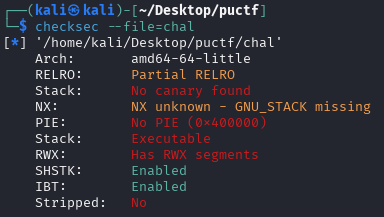
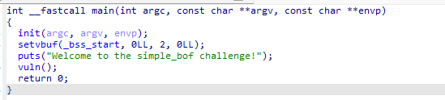
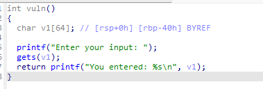
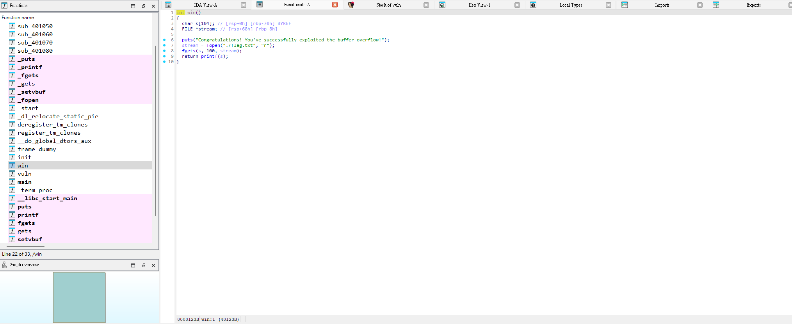
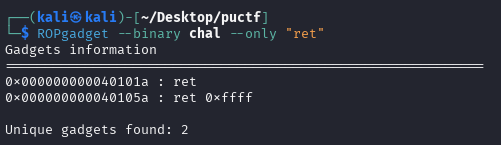
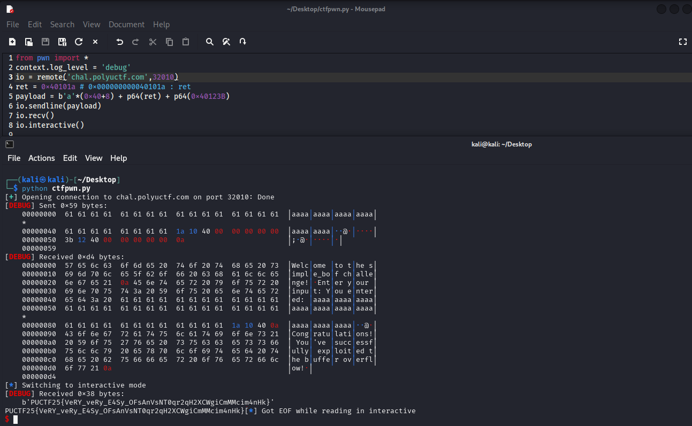

# Babybof

Test your understanding of buffer overflow, and get a great start for your challenge!

Author: Sebastian

Flag Format: PUCTF25{[a-zA-Z0-9_]+_[a-fA-F0-9]{32}}

---

### 1 Check **File Formats :**

First, download the file and use checksec to inspect its properties.



Partial RELRO: In this state, the beginning of the GOT (Global Offset Table) is set to read-only (RO), but the rest remains writable. This helps prevent some basic attacks, but there are still vulnerabilities—such as the GOT table still being writable.

No canary found: It means the binary was compiled without stack canary protection.

No PIE (0x400000) : It means the executable will be loaded at a fixed memory address, rather than a randomized one. Such binaries are relatively weaker in terms of security, because attackers can more easily predict the location of the code and perform attacks like buffer overflows.

### 2 Begin static analysis:

#### 2.1 IDA analysis

Ok, Use IDA to analysis it now.



We can see it will show Welcome to the simple_bof challenge! and then jump to vuln function



In the `vuln`​ function, the system lets us input something and then echoes it back to us. However, we can see that this is a classic buffer overflow problem.

We can see It set `char v1[64];`​  and use gets(v1) to read it

The `gets`​ function does not check the input length. As long as you input more than 64 bytes, the data will overwrite the memory space after `v1`​ (such as the return address or other variables).

This is a buffer overflow. Attackers can exploit this vulnerability to overwrite the return address, and thus execute arbitrary code (for example, jump to shellcode).

Next, we need to think about what command we want to run after triggering the buffer overflow.



We can see that there is a win() function inside the binary, which can directly read flag.txt and output its contents. So, we just need to call this function directly after overflowing the buffer. (This challenge is relatively simple; in more difficult challenges, you might need to find the corresponding libc version, obtain the system address, and then call /bin/sh... but we won’t go into detail about that here.)

#### 2.2 Design the payload

If this were a 32-bit ELF, the required steps would be almost the same. However, since this is a 64-bit binary, there is one extra thing we need to do: we need to obtain a `ret`​ instruction. Here’s the explanation:

When constructing a ROP (Return-Oriented Programming) chain, we must ensure that after each gadget executes, a `ret`​ instruction is executed so that control on the stack can correctly transfer to the next gadget. In other words, after each function call, the stack structure must be correct; otherwise, the program may crash or be detected.

In 64-bit binaries, if you simply overflow to overwrite the return address and jump to a gadget without properly handling stack alignment, it is very easy to cause a crash. Many libc gadgets and system calls require the stack to be 16-byte aligned; otherwise, a segmentation fault will occur. In 32-bit binaries, since parameters are all on the stack and the caller is responsible for stack cleanup, this problem is less common.

In 64-bit binaries, you must "obtain a `ret`​ instruction" to maintain stack balance; otherwise, stack alignment errors or crashes are likely to occur.

So we need to use ROPgadget to search for the required gadgets.

```cmd
ROPgadget --binary chal --only "ret"
```



We will choose 0x40101a be the return address

We already have all the required addresses.

1. overflow (v1 size) : 64 +8 , equal 0x40+8

Why need +8 ?

When you call a function, the stack looks like this (taking x86\_64/Linux as an example):

```sql
| ...               |
| Return Address (8 bytes) | <--- This is the target you want to overwrite
| v1[64]            | <--- Your buffer
| ...               |
```

* **v1[64]** : This is your buffer, and you start filling data from here.
* **Return Address**: This is the 8 bytes right after the buffer (on a 64-bit system).

**Why is it 8 bytes?**   
On a 64-bit system (x86\_64), pointers or return addresses are 8 bytes.  
So, you need to fill up the 64 bytes of `v1`​, and then write 8 more bytes to reach and overwrite the return address.

2. return address : 0x40101a , found in ROPgadget

3. The function we need to call win(): 0x40123B

### 3 Construct the payload :

Let write a script to solve it:

```cmd
from pwn import *
context.log_level = 'debug'
io = remote('chal.polyuctf.com',32247)
ret = 0x40101a # 0x000000000040101a : ret
payload = b'a'*(0x40+8) + p64(ret) + p64(0x40123B)
io.sendline(payload)
io.recv()
io.interactive()
```



So that we can get the flag:

PUCTF25{VeRY_veRy_E4Sy_OFsAnVsNT0qr2qH2XCWgiCmMMcim4nHk}

‍
