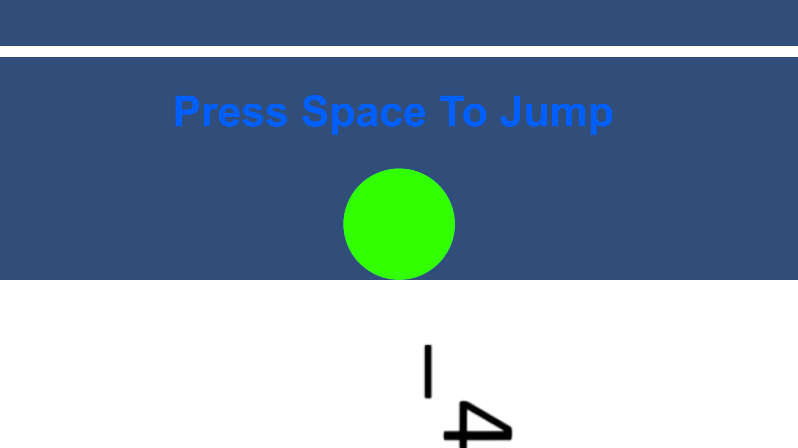
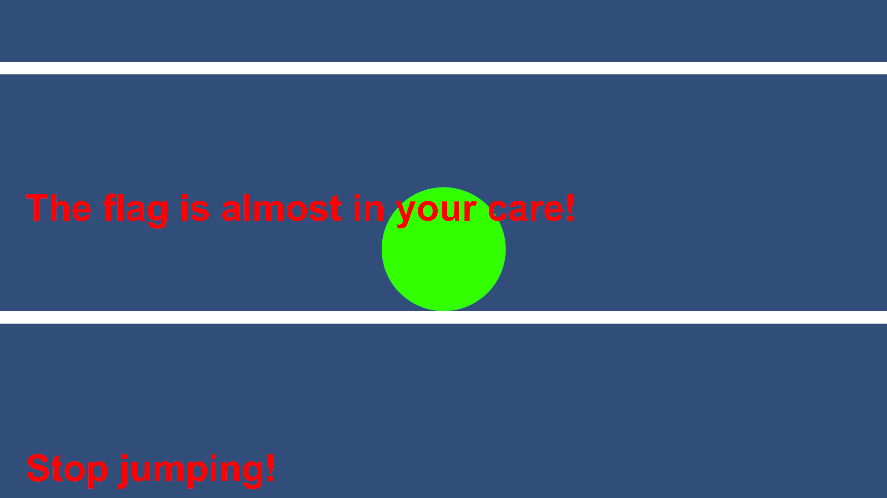
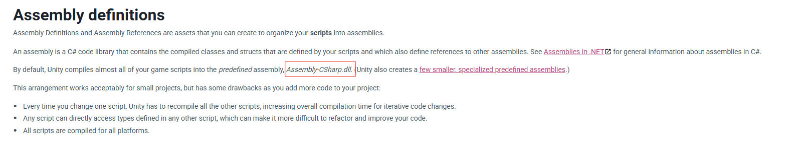
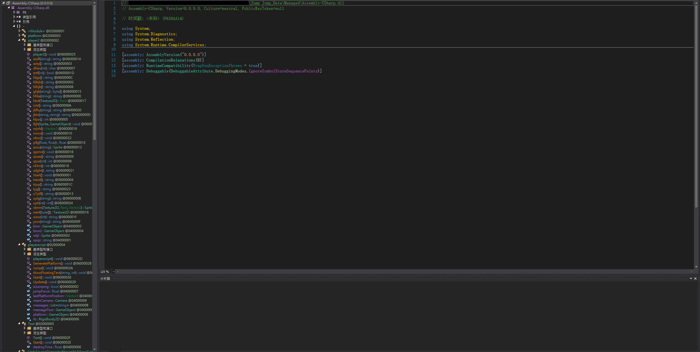
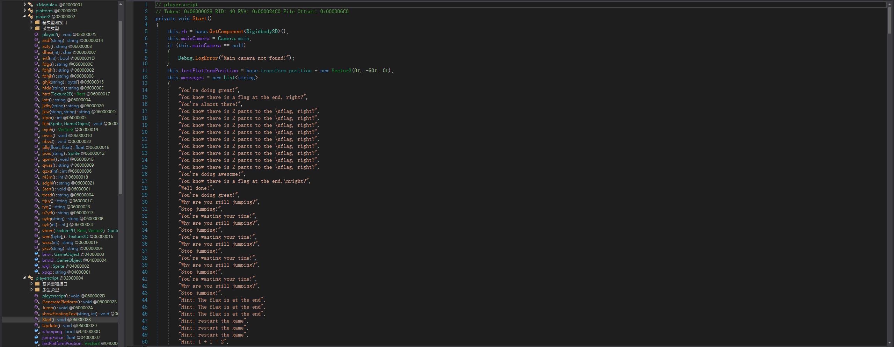
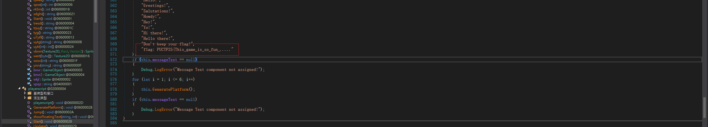
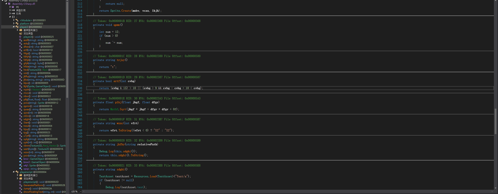
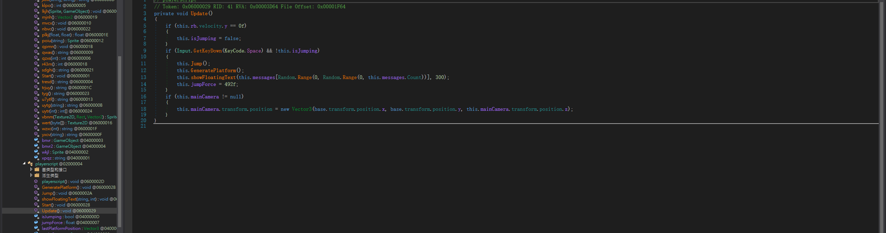
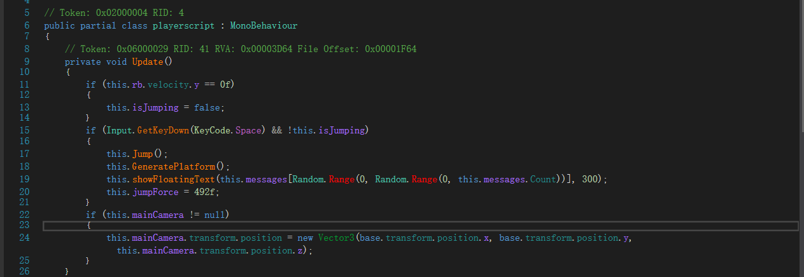
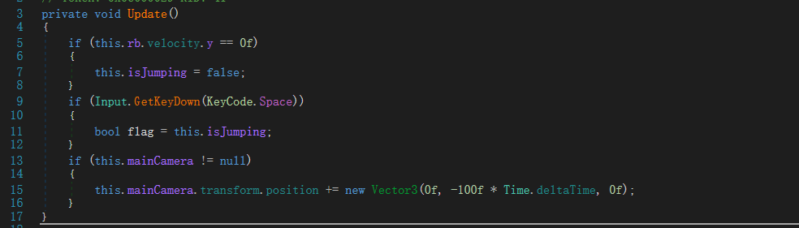

# Jump Jump

I created a simple game for you. Hope you don‘t break your spacebar. Have fun!!!

Author: Paco

Flag Format: PUCTF25{[a-zA-Z0-9_]+_[a-fA-F0-9]{32}}

---

### 1 **File Structure and Initial Observations :**

#### 1.1 **Game File Structure**

First, we download the file and unzip it:

```python
│  Jump Jump.exe
│  UnityCrashHandler64.exe
│  UnityPlayer.dll
│
├─Jump Jump_Data
│  │  app.info
│  │  boot.config
│  │  globalgamemanagers
│  │  globalgamemanagers.assets
│  │  globalgamemanagers.assets.resS
│  │  level0
│  │  RuntimeInitializeOnLoads.json
│  │  ScriptingAssemblies.json
│  │  sharedassets0.assets
│  │  sharedassets0.assets.resS
│  │
│  ├─Managed
│  │      Assembly-CSharp.dll
│  │      Mono.Security.dll
│  │      mscorlib.dll
│  │      netstandard.dll
│  │      System.ComponentModel.Composition.dll
│  │      System.Configuration.dll
│  │      System.Core.dll
│  │      System.Data.DataSetExtensions.dll
│  │      System.Data.dll
│  │      System.dll
│  │      System.Drawing.dll
│  │      System.EnterpriseServices.dll
│  │      System.IO.Compression.dll
│  │      System.IO.Compression.FileSystem.dll
│  │      System.Net.Http.dll
│  │      System.Numerics.dll
│  │      System.Runtime.dll
│  │      System.Runtime.Serialization.dll
│  │      System.Security.dll
│  │      System.ServiceModel.Internals.dll
│  │      System.Transactions.dll
│  │      System.Xml.dll
│  │      System.Xml.Linq.dll
│  │      Unity.2D.Animation.Runtime.dll
│  │      Unity.2D.Common.Runtime.dll
│  │      Unity.2D.IK.Runtime.dll
│  │      Unity.2D.PixelPerfect.dll
│  │      Unity.2D.SpriteShape.Runtime.dll
│  │      Unity.2D.Tilemap.Extras.dll
│  │      Unity.Burst.dll
│  │      Unity.Burst.Unsafe.dll
│  │      Unity.Collections.dll
│  │      Unity.Collections.LowLevel.ILSupport.dll
│  │      Unity.InternalAPIEngineBridge.001.dll
│  │      Unity.Mathematics.dll
│  │      Unity.TextMeshPro.dll
│  │      Unity.Timeline.dll
│  │      Unity.VisualScripting.Antlr3.Runtime.dll
│  │      Unity.VisualScripting.Core.dll
│  │      Unity.VisualScripting.Flow.dll
│  │      Unity.VisualScripting.State.dll
│  │      UnityEngine.AccessibilityModule.dll
│  │      UnityEngine.AIModule.dll
│  │      UnityEngine.AndroidJNIModule.dll
│  │      UnityEngine.AnimationModule.dll
│  │      UnityEngine.ARModule.dll
│  │      UnityEngine.AssetBundleModule.dll
│  │      UnityEngine.AudioModule.dll
│  │      UnityEngine.ClothModule.dll
│  │      UnityEngine.ClusterInputModule.dll
│  │      UnityEngine.ClusterRendererModule.dll
│  │      UnityEngine.ContentLoadModule.dll
│  │      UnityEngine.CoreModule.dll
│  │      UnityEngine.CrashReportingModule.dll
│  │      UnityEngine.DirectorModule.dll
│  │      UnityEngine.dll
│  │      UnityEngine.DSPGraphModule.dll
│  │      UnityEngine.GameCenterModule.dll
│  │      UnityEngine.GIModule.dll
│  │      UnityEngine.GridModule.dll
│  │      UnityEngine.HotReloadModule.dll
│  │      UnityEngine.ImageConversionModule.dll
│  │      UnityEngine.IMGUIModule.dll
│  │      UnityEngine.InputLegacyModule.dll
│  │      UnityEngine.InputModule.dll
│  │      UnityEngine.JSONSerializeModule.dll
│  │      UnityEngine.LocalizationModule.dll
│  │      UnityEngine.NVIDIAModule.dll
│  │      UnityEngine.ParticleSystemModule.dll
│  │      UnityEngine.PerformanceReportingModule.dll
│  │      UnityEngine.Physics2DModule.dll
│  │      UnityEngine.PhysicsModule.dll
│  │      UnityEngine.ProfilerModule.dll
│  │      UnityEngine.PropertiesModule.dll
│  │      UnityEngine.RuntimeInitializeOnLoadManagerInitializerModule.dll
│  │      UnityEngine.ScreenCaptureModule.dll
│  │      UnityEngine.SharedInternalsModule.dll
│  │      UnityEngine.SpriteMaskModule.dll
│  │      UnityEngine.SpriteShapeModule.dll
│  │      UnityEngine.StreamingModule.dll
│  │      UnityEngine.SubstanceModule.dll
│  │      UnityEngine.SubsystemsModule.dll
│  │      UnityEngine.TerrainModule.dll
│  │      UnityEngine.TerrainPhysicsModule.dll
│  │      UnityEngine.TextCoreFontEngineModule.dll
│  │      UnityEngine.TextCoreTextEngineModule.dll
│  │      UnityEngine.TextRenderingModule.dll
│  │      UnityEngine.TilemapModule.dll
│  │      UnityEngine.TLSModule.dll
│  │      UnityEngine.UI.dll
│  │      UnityEngine.UIElementsModule.dll
│  │      UnityEngine.UIModule.dll
│  │      UnityEngine.UmbraModule.dll
│  │      UnityEngine.UnityAnalyticsCommonModule.dll
│  │      UnityEngine.UnityAnalyticsModule.dll
│  │      UnityEngine.UnityConnectModule.dll
│  │      UnityEngine.UnityCurlModule.dll
│  │      UnityEngine.UnityTestProtocolModule.dll
│  │      UnityEngine.UnityWebRequestAssetBundleModule.dll
│  │      UnityEngine.UnityWebRequestAudioModule.dll
│  │      UnityEngine.UnityWebRequestModule.dll
│  │      UnityEngine.UnityWebRequestTextureModule.dll
│  │      UnityEngine.UnityWebRequestWWWModule.dll
│  │      UnityEngine.VehiclesModule.dll
│  │      UnityEngine.VFXModule.dll
│  │      UnityEngine.VideoModule.dll
│  │      UnityEngine.VirtualTexturingModule.dll
│  │      UnityEngine.VRModule.dll
│  │      UnityEngine.WindModule.dll
│  │      UnityEngine.XRModule.dll
│  │
│  ├─Plugins
│  │  └─x86_64
│  │          lib_burst_generated.dll
│  │
│  └─Resources
│          unity default resources
│          unity_builtin_extra
│
└─MonoBleedingEdge
    ├─EmbedRuntime
    │      mono-2.0-bdwgc.dll
    │      MonoPosixHelper.dll
    │
    └─etc
        └─mono
            │  browscap.ini
            │  config
            │
            ├─2.0
            │  │  DefaultWsdlHelpGenerator.aspx
            │  │  machine.config
            │  │  settings.map
            │  │  web.config
            │  │
            │  └─Browsers
            │          Compat.browser
            │
            ├─4.0
            │  │  DefaultWsdlHelpGenerator.aspx
            │  │  machine.config
            │  │  settings.map
            │  │  web.config
            │  │
            │  └─Browsers
            │          Compat.browser
            │
            ├─4.5
            │  │  DefaultWsdlHelpGenerator.aspx
            │  │  machine.config
            │  │  settings.map
            │  │  web.config
            │  │
            │  └─Browsers
            │          Compat.browser
            │
            └─mconfig
                    config.xml
```

After extracting the archive, the directory contains the following main files:

* **Jump Jump.exe**: Main executable file
* **UnityPlayer.dll**: Unity game engine core library
* **Jump Jump_Data/** : Game data folder
* **Managed/** : Contains compiled game scripts in DLL format (e.g., Assembly-CSharp.dll)
* **Resources**, **Plugins**, **MonoBleedingEdge**: Additional subfolders for resources, plugins, and Mono runtime

Based on the directory structure and the presence of UnityPlayer.dll, it can be determined that this is a Unity-based game.

#### 1.2 Game Launch and Initial Observation

Double-click to run Jump Jump.exe.



We can see this at the bottom of the screen in the window. We notice '\_4', which might be part of the flag. We can check it later. After we press the space key, it allows us to jump to the platform above, and some text appears.



### 2 Unity Script and DLL Static Analysis :

#### 2.1 Unity Script Storage Logic

As CTF players, we know that getting the flag through normal gameplay is either impossible or very difficult. Therefore, we decided to go back to the folder and analyze the game files.

From the [Unity Documentation](https://docs.unity3d.com/2019.4/Documentation/Manual/ScriptCompilationAssemblyDefinitionFiles.html) We know that By default, Unity compiles almost all of your game scripts into the predefined assembly, Assembly-CSharp.dll.



#### 2.2 Analyzing DLLs with dnSpy

So, we openedthe Assembly-CSharp.dll from the game folder (Jump Jump\_Data/Managed/Assembly-CSharp.dll) using [dnSpy](https://github.com/dnSpy/dnSpy), which is a debugger and .NET assembly editor."



##### 2.2.1 Main Classes and Functions

* Platform
* Player2
* PlayerScript
* Text

By analyzing these classes and functions one by one, it was found that the `Start()`​ function in `PlayerScript`​ contains a list of in-game text.



Eventually, in the Start() function of PlayerScript, we found a list containing some text that appears in the game. We continued to examine this function in detail.

##### 2.2.2 Found Flag Clues



We can see the flag in line 570 . "flag: PUCTF25{This_game_is_so_fun_....." , However, we could only see half of the flag, so we continued analyzing the DLL file.



### 3 In-depth Analysis

In the Player2 class, we found something that looked like an algorithm. However, after giving the code to an AI, it suggested that the original message was stored in the game resources. This confirmed that the text at the bottom of the game screen is part of the flag.  
We also know that after pressing the space button, the camera moves up, but the flag is actually below the screen. Therefore, we need to either modify the camera location or extract additional game resources to get the other part of the flag. Since we already have dnSpy open and it supports editing DLL files, we chose to edit the game DLL to make the camera move down.

#### 3.1 Further Analysis

From the [Unity Documentation](https://docs.unity3d.com/6000.0/Documentation/ScriptReference/MonoBehaviour.Update.html) We know that `Update`​ is the most commonly used function to implement any kind of game script



Here, we can see the core game logic. For example, when the game detects that we press the space bar, it calls the Jump function, generates a new platform, and displays some text. On line 18, we see some logic related to the camera coordinates. Therefore, we can modify this part to make the camera move down.

#### 3.2 Edit the DLL to Enable Camera Movement

We can right click change method and change the code to:

```c
this.mainCamera.transform.position += new Vector3(0f, -100f * Time.deltaTime, 0f);
```

To make our camera keep moving down (since I’m not familiar with Unity, I provided the original code to an AI and asked it to help me modify the code so the camera would move downward).

After that we save it.

You may see this problem ( Range is Error because we don't have the correct dll file)



We can delete the code from line 17 to line 20 to solve it.

Finally like :



#### 3.3 Run the Modified Game

<video controls="controls" src="assets/part2flag-20250421232736-9zusp2n.mp4" data-src="assets/part2flag-20250421232736-9zusp2n.mp4"></video>

Afte then you can get the another part of tha flag:

_4bc69ccfb67906528c43a56b91dcc7d5}

### 4 Flag :

Put the two parts together. : PUCTF25{This_game_is_so_fun_4bc69ccfb67906528c43a56b91dcc7d5}

### 5 Conclusion:

* Extract the game files and confirm that it is a Unity game.
* Use dnSpy to open and analyze Assembly-CSharp.dll.
* Search for flag clues and discover partial content.
* Modify the DLL to make the camera move downward and obtain the remaining flag.
* Assemble the flag to complete the challenge.
