# Normal Application I

Can you reverse the application and give me the flag

Author: R1ckyH

Flag Format: PUCTF25{[a-zA-Z0-9_]+}

---

### 1 **AAB to APK Conversion and Installation Process** :

#### 1.1 Change to apk:

We download the attachment we can wee app-release.aab ,According to information on the Internet , it's apk friend , which is the software package that install in Android . However, since the .aab file cannot be directly installed on a mobile device, I first used the [bundletool tool](https://github.com/google/bundletool) to convert the .aab file into .apks.

```cmd
java -jar bundletool-all.jar build-apks --bundle=app-release.aab --output=release.apks
```

Then, you can use the adb shell command to directly install the .apks file, or use the [MT Manager](https://mt2.cn/download/) to convert the .apks to an .apk file and then install it. Here I convert to apk

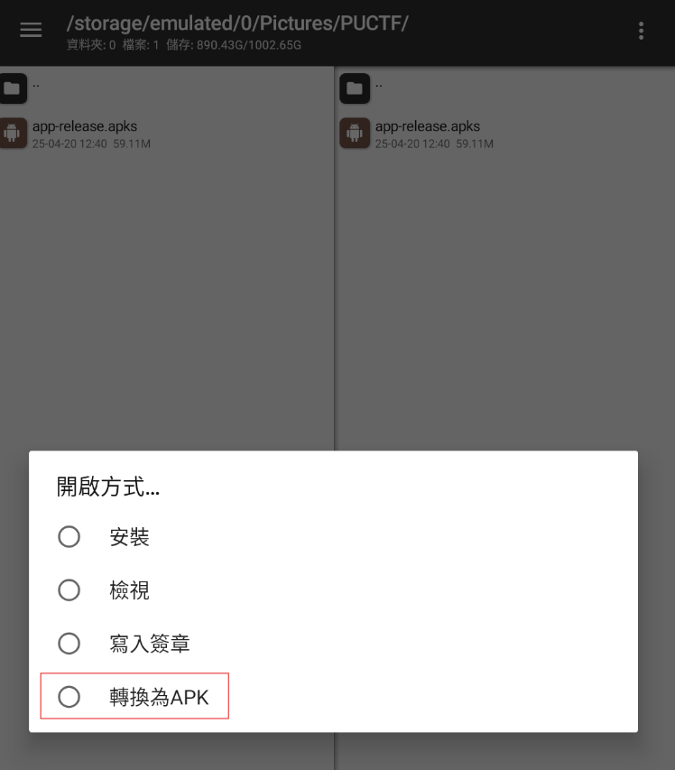


#### 1.2 Install the Apk file

After installation, it can run on the Android device.


The title above says "Press + for xx times?" There is a number displayed in the center of the page, and a "+" button at the bottom right corner. Therefore, it can be inferred that pressing the "+" button in the bottom right corner a certain number of times will trigger the appearance of the flag.I tried continuously clicking, and when the number reached 20, a fake flag appeared on the screen.

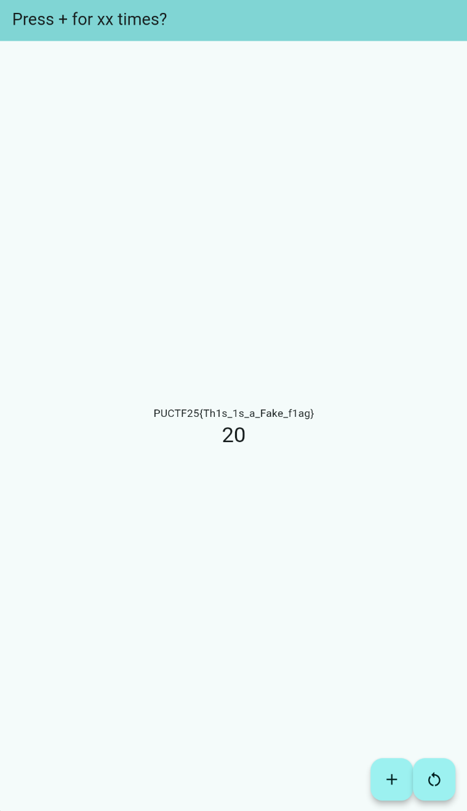

### 2 **Static Analysis and Reverse Engineering Process** :

#### 2.1 **Parsing AndroidManifest.xml**

Based on previous CTF experience, it’s unlikely that simply clicking will yield the real flag. Therefore, it’s necessary to start reversing the application, beginning with the AndroidManifest.xml file. 

You can use tools like [Jadx](https://github.com/skylot/jadx) or MT Manager for this task. Since I am already using MT Manager, I chose to proceed with MT Manager.

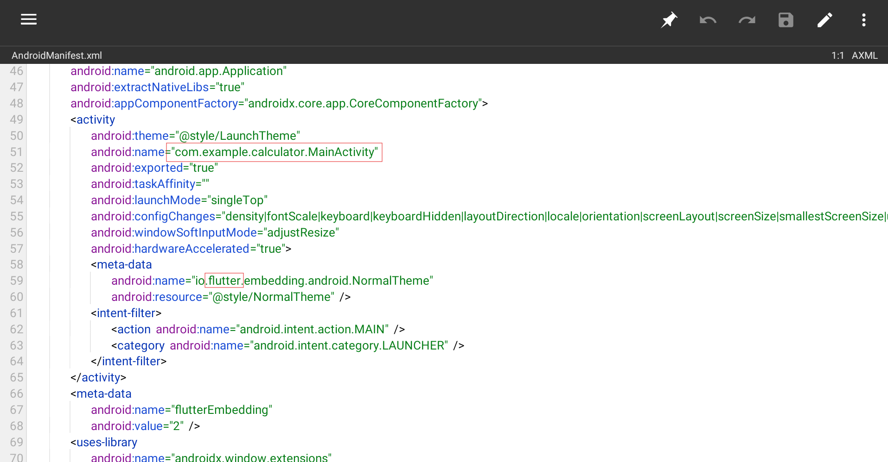

We can obtain some key information from the AndroidManifest.xml file. The launch activity is `com.example.calculator.MainActivity`​, as indicated by the `<action android:name="android.intent.action.MAIN" />`​ tag. Additionally, we can see `io.flutter.embedding.android.NormalTheme`​, which suggests that this application is developed using [Flutter](https://flutter.dev/).

#### 2.2 **DEX File Analysis :**

Therefore, we open the dex files to locate and see what information (such as classes and activities) can be found.

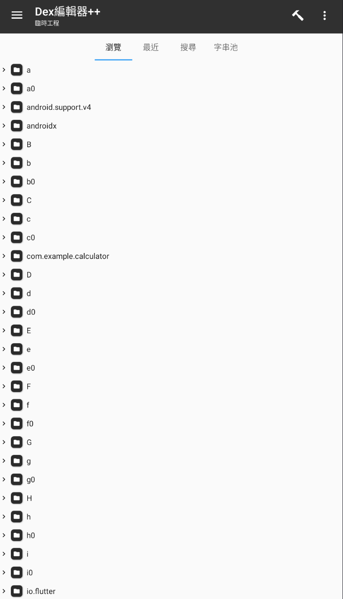

We can see that the dex files have been obfuscated by the author, but the package `com.example.calculator`​ is still clearly visible. So, we go inside to take a closer look.

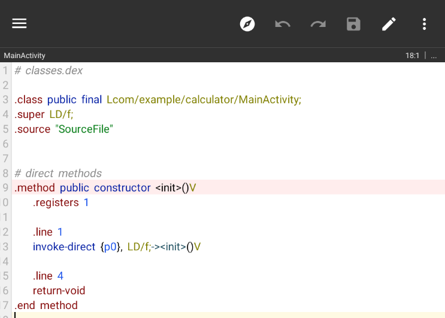

After opening it, we only see that it performs some initialization (init), but nothing valuable is found.Since the other classes are all obfuscated, I believe the author wouldn’t make it that straightforward for us :)

#### 2.3 **ELF File Analysis :**

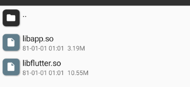

Therefore, I switched to IDA to open the libapp.so file and see if there’s anything interesting inside. At the same time, we also see the presence of libflutter.so, which further confirms that this application was developed using Flutter.

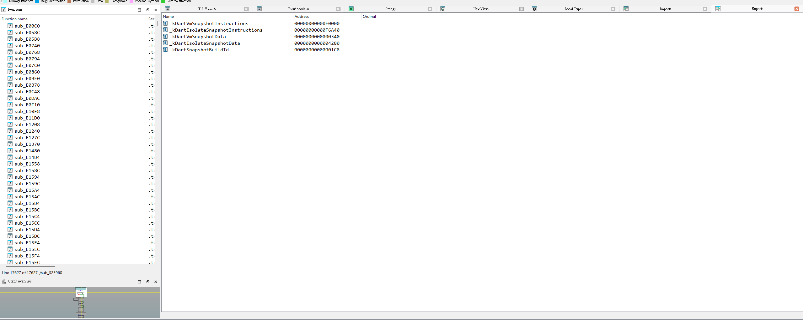

#### 2.4 Find the Flag

#### 2.4.1 Search the Flag

I found that the .so file doesn’t contain any init or main functions, and I had no idea how to find the flag. Therefore, I switched to using the "Find String" function.

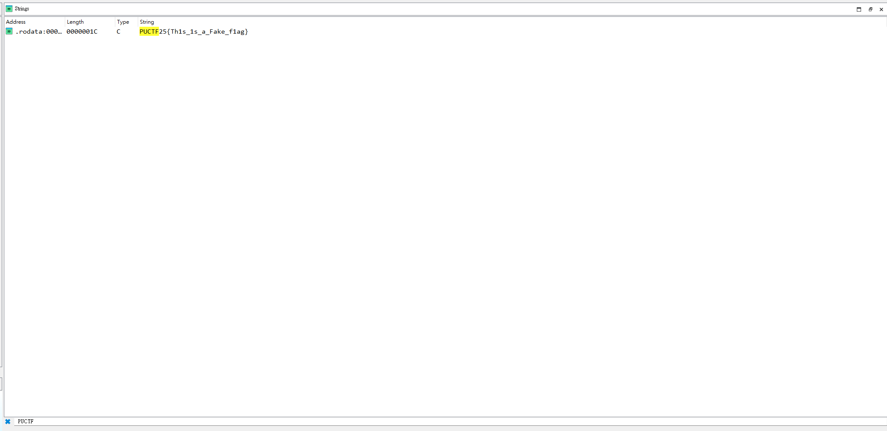

However, I only found the fake flag as well. , So I started thinking, maybe some other method was used to hide the flag? One of the most common ways is Base64 encoding, so I searched for ==

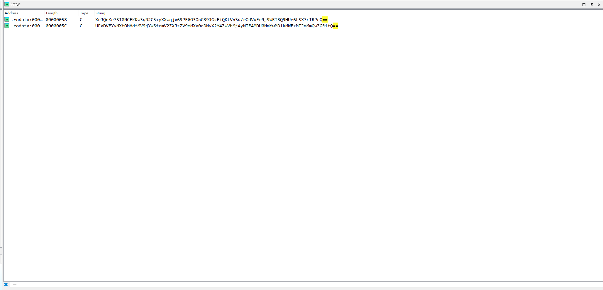

We found two results, so we checked both of them individually.

#### 2.4.2 Decode the Flag

I used [CyberChef](https://gchq.github.io/CyberChef/) to check whether they were Base64 encoded or not.

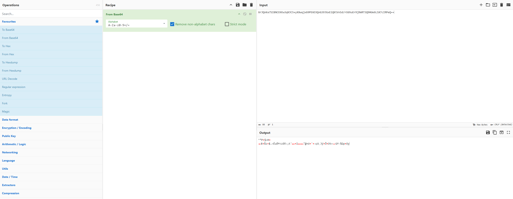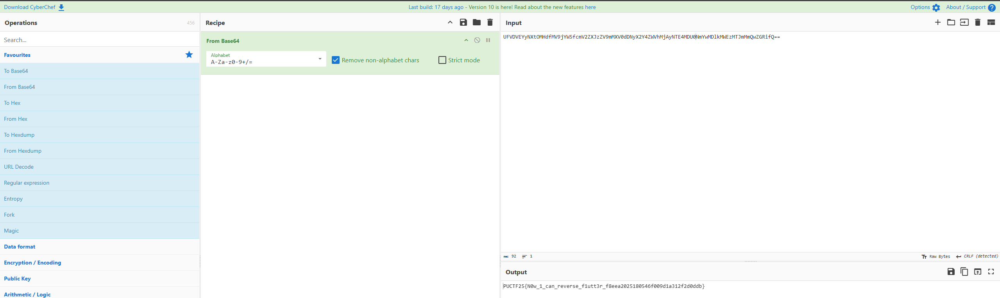

We can see the second result turned out to be the flag.

PUCTF25{N0w_1_can_reverse_f1utt3r_f8eea2025180546f009d1a312f2d0ddb}

### 3 Conclusion:

* Download the AAB and use bundletool to convert it to APK and install.
* Initial interaction reveals a fake flag.
* Reverse engineer the AndroidManifest.xml, DEX, and SO files.
* Try various search and decoding methods; finally, obtain the flag by decoding with Base64.
