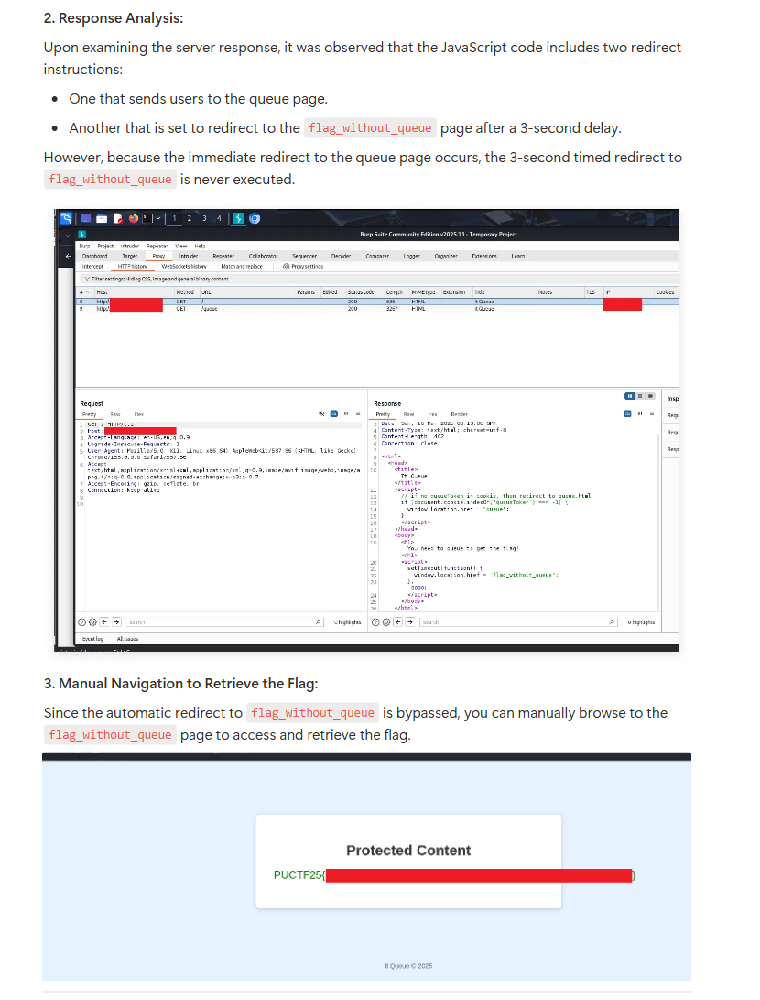
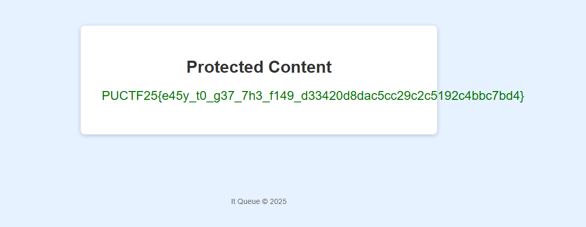

# It-queue

Because this challenge is hosted on a potato server in this time, to avoid crashing the server, we have implemented a queue system to reduce the load on the server.

Author: SalaryThief

Flag Format: PUCTF25{[a-zA-Z0-9_]+_[a-fA-F0-9]{32}}

---

We followed the guideline provided here: :

https://nuttyshell.notion.site/Guide-of-Beginner-Challenges-1ccd5c0f2b068034b994d631712f4dc0#1d0d5c0f2b0680b385faf2b3d9c86e5b

So we accessed [http://chal.polyuctf.com:41339/flag_without_queue](http://chal.polyuctf.com:41339/flag_without_queue) to get the flag.

PUCTF25{e45y_t0_g37_7h3_f149_d33420d8dac5cc29c2c5192c4bbc7bd4}
