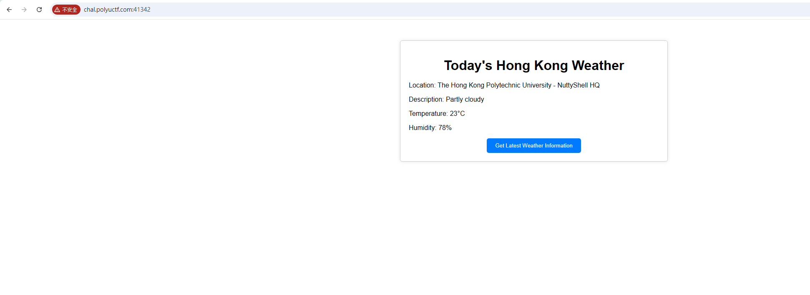
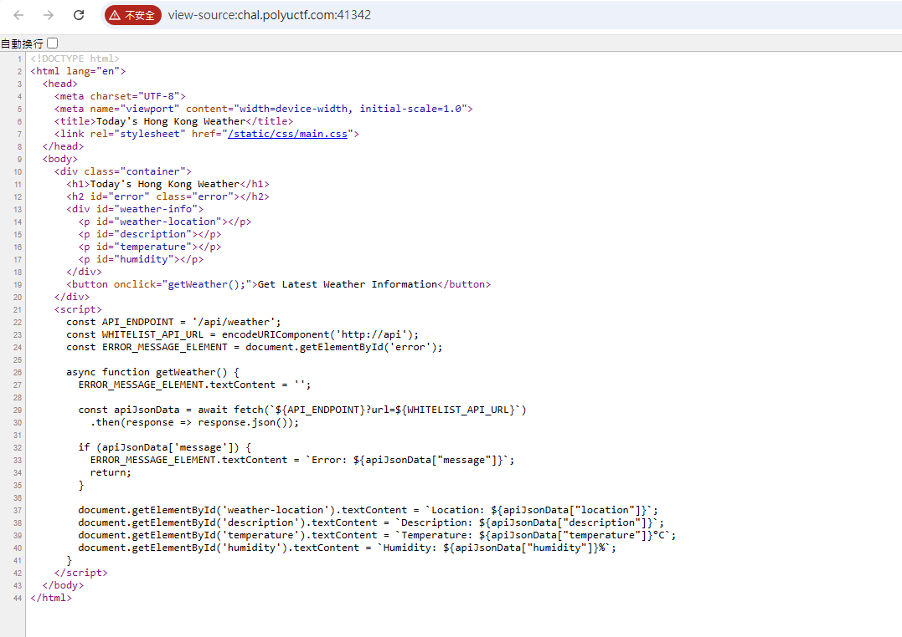
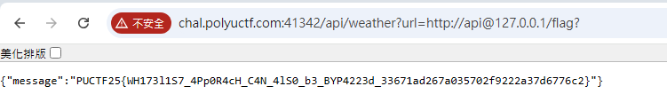

# JSON My Soul

G'day mate, I love JSON, so much so that all the data from my internal weather API service are in JSON format!

Author: siunam

Flag Format: PUCTF25{[a-zA-Z0-9_]+_[a-fA-F0-9]{32}}

---

### 1 Static analysis :

When we accessed this website, we saw a page about Hong Kong weather.

And if we use `curl -u`​, we can see the JavaScript source code of this website.

### 2 Summarize the information :

**Frontend Behavior**  
The frontend calls `/api/weather`​ with a `url`​ parameter, which is an encoded version of `http://api`​.  
This means the backend will fetch external resources based on the `url`​ parameter and return the result to the frontend.

**URL Parsing Rule**  
According to the URL standard, in a URL like `http://user@host/path`​, the actual host being requested is `host`​; the `user`​ part is just user info and does not affect the final target.

**Exploitation Point**  
If we set the `url`​ parameter to `http://api@127.0.0.1/flag`​, the string still starts with `http://api`​, so it passes the backend whitelist check.  
However, the real host in this URL is `127.0.0.1`​, and the path is `/flag`​. This allows us to exploit SSRF to request local resources.

**Exploitation Flow Reasoning**

* The frontend just passes the `url`​ to the backend without strict restrictions.
* The backend likely only checks the string prefix, not the actual hostname.
* According to RFC standards, `http://api@127.0.0.1/flag`​ is parsed as `hostname=127.0.0.1`​.
* Therefore, we can construct a payload that makes the backend request the local `/flag`​ file.

### 3 Construct the payload :

So we tried to use http://chal.polyuctf.com:41342/api/weather?url=http://api@127.0.0.1/flag . However it response `{"message":"Something went wrong with the API service. Sorry!"}`​

I continued to try different payloads, and finally discovered that you need to add a ? at the end.

http://chal.polyuctf.com:41342/api/weather?url=http://api@127.0.0.1/flag?

​`PUCTF25{WH173l1S7_4Pp0R4cH_C4N_4lS0_b3_BYP4223d_33671ad267a035702f9222a37d6776c2}`​

This might be because when the backend checks the url parameter, it not only requires the string to start with http://api, but also enforces that the URL contains a ? character. In other words, the backend considers “only requests with a query string” to be valid API requests.
